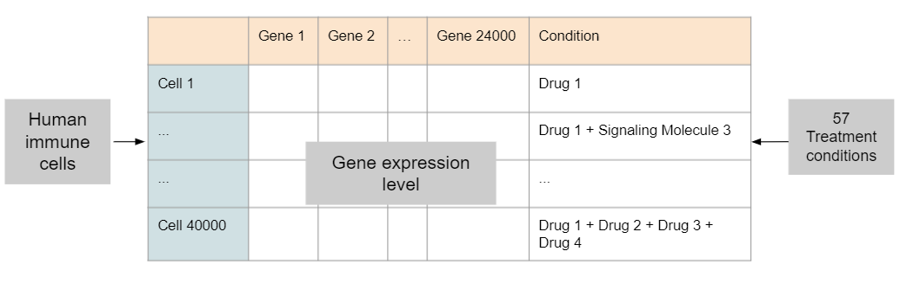
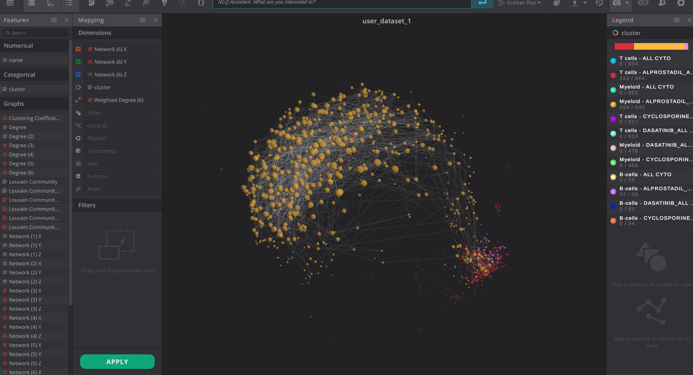

# 2021 Virtualitics Caltech Hackathon

**Note**: This project was done by [Saehui Hwang](https://github.com/saehuihwang), Archie Shahidullah, and [Liam 
Silvera](https://github.com/lm-silvera). We placed [second](https://blog.virtualitics.com/virtualitics-wraps-up-2021-caltech-data-science-hackathon) in the Bioinformatics track.

This project analyzes gene expression in response to treatments thought to 
mimic a COVID-19 inflammatory response in cells. We use a deep autoencoder to 
generate embeddings for gene expressions, which are then used to create a 
network in VIP.

The data were generously provided to us by 
[Matt Thomson](https://spec.caltech.edu/). It consisted of transcription-based
gene expression values for ~47000 cells along ~37000 genes. This was later reduced by filtering. The structure
of the raw data is shown below.

After reducing the gene expression vectors (each row) to 128-dimensional latent encodings with our autoencoder, we performed clustering in Virtualitic's VIP software to identify trends for future investigation.

An example of a graph indicating cell response to the drug Alprostadil is below.

We concluded that the drug Dasatinib consistently clustered close to the cytokine controls, indicating a lack of significant gene expressions to this drug. It was also noted that Myeloid cells produced markedly different responses for all drugs versus T and B cells. It is noted this project only indicates a response to drugs to mark certain treatments for future study, not whether this response is an effective immune reaction to COVID-19.
